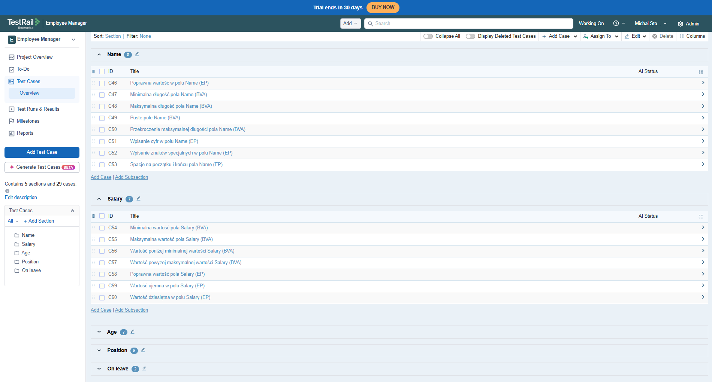
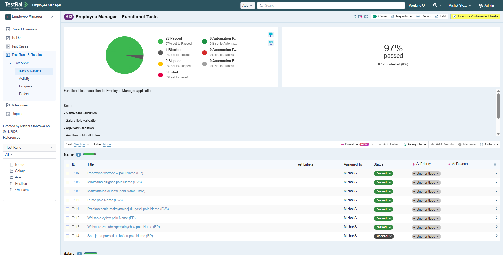

# TestRail – Employee Manager

## Test Run

**Test Run:** Employee Manager – Functional Tests

**Test cases:** 29

### Results

| Status  | Count |
| ------- | ----: |
| Passed  |    28 |
| Blocked |     1 |
| Failed  |     0 |
| Total   |    29 |

**Pass rate:** 97%

## Test case structure

Test cases were organized into the following sections:

- Name – 8 test cases
- Salary – 7 test cases
- Age – 7 test cases
- Position – 5 test cases
- On leave – 2 test cases

## Test techniques

The test cases were designed using:

- Equivalence Partitioning (EP)
- Boundary Value Analysis (BVA)
- Decision Table Testing

## Blocked test case

**TC-NAME-008 – Spacje na początku i końcu pola Name (EP)**

Status: **BLOCKED**

The expected behavior for leading and trailing spaces was not clearly defined. The test case therefore requires clarification from the Product Owner before it can be conclusively evaluated.

## Evidence

### Test cases

### Test Run results

### Blocked test case

